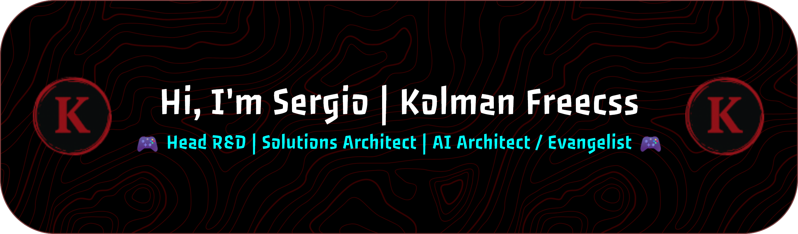

<!-- Fonts -->
<link rel="preconnect" href="https://fonts.googleapis.com">
<link rel="preconnect" href="https://fonts.gstatic.com" crossorigin>
<link href="https://fonts.googleapis.com/css2?family=Exo+2:ital,wght@0,100..900;1,100..900&display=swap" rel="stylesheet">

### 

**コルマン・フリークス**  

  
  
  

    
<pre>
🧠 Head of R&D · Tech Lead · Solutions Architect · AI Architect / Evangelist (MSc in Video Game Programming)
    
⚙️ AI | Cloud | DevOps · Open Source contributor · GitHub Developer Program
    
📨 I run an active newsletter about AI, Architecture and Cloud
    
🎮 WoW · Games · Anime · Sport
    
🤝 Open to collaborate on AI and videogame projects
    
💥 Pro Player (Csgo, WoW, Valorant)
</pre>

  
  
  
  

## 🧾 About

> 🚀 I build production-grade platforms with a focus on **clean architecture**, **scalability**, and **developer experience**.  
>
> 🧩 Experienced in leading **R&D initiatives** around AI, multi-cloud infrastructure, and CI/CD automation — turning cutting-edge tech into real business outcomes.  
>
> 🎮 From **Game Jams** to enterprise systems: I bridge creativity and engineering, applying lessons from game dev into resilient distributed architectures.  
>
> 🔭 Founder of <b>Sensoria</b>, driving innovation in AI and DevOps, with contributions across **open source projects** and **developer communities**.  

## 🛰️ Socials & Newsletter

  <a href="https://www.linkedin.com/in/sergiomartinezroman/">🔗 LinkedIn</a> · 
  <a href="https://www.kolmanfreecss.com/subscribe">📰 Subscribe to my Newsletter</a> · 
  <a href="https://anilist.co/user/KolmanFreecss/animelist">🎴 AniList</a>

## 🧰 Tech Stack

### 🧑‍💻 Languages  
&nbsp;
&nbsp;
&nbsp;
&nbsp;
&nbsp;
&nbsp;
&nbsp;

### 🧩 Backend & APIs  
&nbsp;
&nbsp;
&nbsp;
&nbsp;

### 🎨 Frontend  
&nbsp;
&nbsp;

### 🧠 Data & AI  
&nbsp;
&nbsp;
&nbsp;
&nbsp;
&nbsp;
&nbsp;
&nbsp;
&nbsp;

### ☁️ Cloud & Infra  
&nbsp;
&nbsp;
&nbsp;
&nbsp;
&nbsp;

### 🏗️ DevOps & CI/CD  
&nbsp;
&nbsp;
&nbsp;
&nbsp;
&nbsp;
&nbsp;
&nbsp;

### 🗄️ Databases & Storage  
&nbsp;
&nbsp;
&nbsp;
&nbsp;
&nbsp;
&nbsp;

### 🧩 Observability  
&nbsp;
&nbsp;

### 🎮 Game Engines  
&nbsp;
&nbsp;

## 🏆 Achievements

  

## 📊 Stats

  
  

## 📨 Newsletter

  Weekly(ish) notes on <b>AI in practice</b>, <b>Cloud architecture</b>, and <b>DevOps at scale</b>. 
  👉 <a href="https://www.kolmanfreecss.com/subscribe"><b>Subscribe here</b></a> and join the ride!

## ✍️ Random Dev Quote

## ☕ Support

  

##  Visitor Counter

